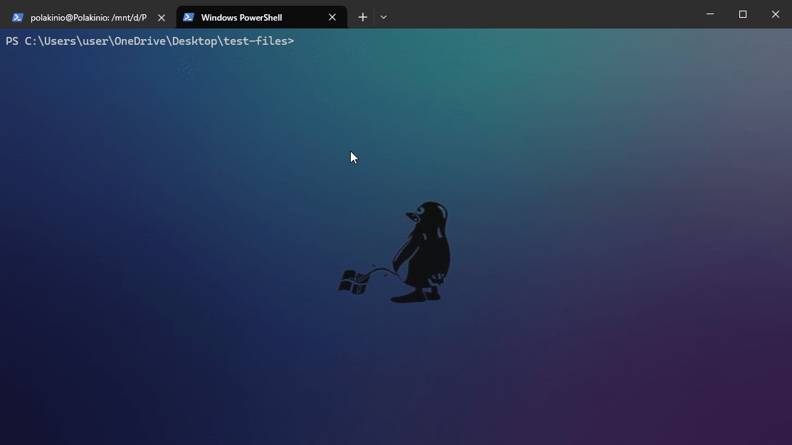

# WTouch

```
 _       ________                 __
| |     / /_  __/___  __  _______/ /_
| | /| / / / / / __ \\ / / / / ___/ __ \
| |/ |/ / / / / /_/ / /_/ / /__/ / / /
|__/|__/ /_/  \\____/\\__,_/\\___/_/ /_/
```

`wtouch` is a Windows-native recreation of the GNU `touch` utility. It creates files on demand and updates access or modification timestamps without altering file contents. The implementation uses Win32 APIs so it works seamlessly with Unicode paths, files, and directories.

### Quick workflow overview



1. **Create or update timestamps** for one or more files with `wtouch file.txt`.
2. **Adjust modification or access times** using the `-m` and `-a` switches.
3. **Copy timestamps from a reference file** by adding `-r existing.txt`.
4. **Provide explicit timestamps** through `-d` or `-t` when you need deterministic values.

These are the same steps covered in detail in the [Command-line usage](#command-line-usage) section further down in the README, so you can follow along visually before diving into the command reference.

## Disclaimer

This project was originally created using OpenAI's Codex model.

## Features

* Create files when they do not yet exist (unless `--no-create` is provided).
* Update access times (`-a`) and/or modification times (`-m`).
* Copy timestamps from another file with `-r`.
* Apply explicit timestamps via `-d` (ISO-like strings) or `-t` (`[[CC]YY]MMDDhhmm[.ss]`).
* Accept multiple paths and expand Windows wildcards internally via `FindFirstFileW`.
* Works with both files and directories, honoring Unicode paths.

## Building from source

1. Install your preferred build tools:
   * **Windows (Developer PowerShell workflow)** – install the latest [Visual Studio Build Tools](https://visualstudio.microsoft.com/downloads/) with the “Desktop development with C++” workload, [CMake](https://cmake.org/download/), and [Ninja](https://ninja-build.org/). Run the commands shown below from **Developer PowerShell for VS** so that `cl.exe` is available to CMake and Ninja.
   * **Windows (Visual Studio Code integration)** – follow the Developer PowerShell setup above, then install the official [CMake Tools extension](https://marketplace.visualstudio.com/items?itemName=ms-vscode.cmake-tools). Launch **Developer PowerShell for VS** before opening VS Code so that the MSVC environment is available to both PowerShell and the editor.
   * **Linux/macOS** – install a recent C++17 compiler, CMake, and Ninja.

   On Windows you can let the repository install the prerequisites for you. Launch an elevated **Developer PowerShell for VS** or Windows Terminal session and run:

   ```powershell
   # Installs Visual Studio Build Tools (C++ workload), CMake, and Ninja when missing
   .\scripts\ensure-windows-deps.ps1
   ```

   The script uses `winget` to install packages. If `winget` is not available, install it from the Microsoft Store first. You can skip individual checks with `-SkipVisualStudio`, `-SkipCMake`, or `-SkipNinja`.
2. Open a terminal or Developer PowerShell and clone this repository.
3. Configure and build using the bundled CMake presets. They automatically pick
   the right generator for your platform when run from Developer PowerShell.
   The same presets are recognised by Visual Studio Code through the
   CMake Tools extension if you prefer that workflow:

   ```powershell
   # Windows
   cmake --preset windows-release
   cmake --build --preset windows-release

   # Linux/macOS
   cmake --preset ninja-release
   cmake --build --preset ninja-release
   ```

   If you prefer to invoke CMake manually, make sure to specify a generator
   that matches your toolchain, for example:

   ```powershell
   cmake -S . -B build -G "Visual Studio 17 2022" -A x64
   cmake --build build --config Release

   # or use Ninja (single-config, works on Windows, Linux, and macOS)
   cmake -S . -B build -G Ninja -DCMAKE_BUILD_TYPE=Release
   cmake --build build
   ```

   The resulting executable will be written to
   `build/Release/wtouch.exe`. When using the Windows preset the binary lives at
   `build/windows-release/Release/wtouch.exe` until you run the install step, so
   invoke it with that relative path or change into that directory first.

   After building on Windows, run `cmake --install build/windows-release --config
   Release` (or `.\scripts\install-wtouch.ps1`) to copy `wtouch.exe` to the
   configured install location and refresh your `PATH`. See [Using CMake
   install](#using-cmake-install) below for the full walkthrough of what the
   install step does and how to customise it.

### Troubleshooting CMake on Windows

If `cmake --preset windows-release` reports that it "could not find any instance
of Visual Studio," one of the following issues is usually the cause:

* **Visual Studio Build Tools are not installed.** Install the latest Visual
  Studio (or the standalone Build Tools) and include the **Desktop development
  with C++** workload. The CMake preset targets the `Visual Studio 17 2022`
  generator, so MSVC 2022 must be available on the machine.
* **The Visual Studio environment is not initialised in the current shell.**
  Launch **Developer PowerShell for VS** (installed with Visual Studio) and run
  `cmake` from that prompt, or run `vcvarsall.bat x64` in a regular PowerShell
  session before invoking CMake. This ensures `cl.exe` and the required
  environment variables are visible to the generator detection logic.

After installing the tools or initialising the environment, rerun the preset
command.

## Installation

### Using CMake install

Run the standard install target to copy the binary to `CMAKE_INSTALL_PREFIX`
(defaults to `C:\Program Files\wtouch`). On Windows, the installer also appends
the chosen install directory to your user `PATH` automatically unless you opt
out during configuration. From an elevated Developer PowerShell prompt run:

```powershell
cmake --install build/windows-release --config Release
```

If you prefer to drive the build from Visual Studio Code, pick the
`windows-release` configure preset from the CMake Tools status bar, build it,
and then run the **CMake: Install** command from the palette.

To skip the automatic `PATH` update, configure the project with
`-DWTOUCH_INSTALL_ADD_TO_PATH=OFF` before running the install step.

### Using the prebuilt binary

A prebuilt binary is optionally published at [https://github.com/your-org/wtouch/releases/latest/download/wtouch.exe](https://github.com/your-org/wtouch/releases/latest/download/wtouch.exe).

You can install it directly with PowerShell:

```powershell
$destination = "$env:ProgramFiles\wtouch"
New-Item -ItemType Directory -Path $destination -Force | Out-Null
Invoke-WebRequest -Uri "https://github.com/your-org/wtouch/releases/latest/download/wtouch.exe" -OutFile (Join-Path $destination 'wtouch.exe')
```

After installation, add `$destination` to your `PATH` if it is not already present.

### Installing from a PowerShell prompt (any build)

The helper script works with both the native C++ binary and the portable C
implementation. Run it from Developer PowerShell or another prompt with the
compiler environment initialised:

```powershell
.\scripts\install-wtouch.ps1                 # installs the native build
.\scripts\install-wtouch.ps1 -Variant c      # installs the portable C build

# Common flags
.\scripts\install-wtouch.ps1 -SkipCopy         # only update PATH
.\scripts\install-wtouch.ps1 -SkipPathUpdate   # only copy binaries
.\scripts\install-wtouch.ps1 -Destination "C:\Tools\wtouch"
```

> **Important**: The default destination is `%ProgramFiles%\wtouch`, which is protected by UAC. Run the script from an elevated PowerShell session (for example, **Developer PowerShell for VS** launched *As Administrator*) or supply `-Destination` pointing to a user-writable directory. If the binaries are already present, rerunning the script without `-Force` skips the copy step while still refreshing the user `PATH`.

When invoked without `-SkipPathUpdate`, the script ensures the destination is
present on the user `PATH`, which is ideal for PowerShell- and VS Code-based
workflows.

### Uninstalling

To remove a previously installed binary, run the companion uninstall script.
It deletes the selected implementation from the destination directory and
removes the folder from your user `PATH` when present:

```powershell
.\scripts\uninstall-wtouch.ps1                  # removes the native build
.\scripts\uninstall-wtouch.ps1 -Variant c       # removes the portable C build
```

Removing the default `%ProgramFiles%\wtouch` installation also requires an elevated PowerShell session. Provide `-Destination` when you installed the binary to a different directory.

The uninstall script only deletes empty directories, so if you placed other
files in the installation folder they will be preserved.

### Available implementations

`wtouch` now ships four standalone implementations that can live side by side.
Each one resides in its own subdirectory (or the original `src` tree for the
native build) so that installing one will not interfere with the others:

* **Native C++ binary** – `src/touch.cpp`, built with CMake as described above.
* **Bash script** – `bash/wtouch.sh`, a wrapper around the host `touch`.
* **Portable C utility** – `c/wtouch.c`, a cross-platform reimplementation.
* **Python script** – `python/wtouch.py`, relying only on the standard library.

The sections below outline how to install each flavour individually.

#### Native C++ version

The Windows-native C++ implementation remains the primary build. Follow the
instructions in [Building from source](#building-from-source) to compile it with
CMake. To install the resulting executable alongside the other versions without
conflict, choose a unique destination filename when copying it onto your
`PATH`, for example:

```powershell
cmake --build build --config Release
Copy-Item build/Release/wtouch.exe "$env:ProgramFiles\\wtouch\\wtouch-cpp.exe"
```

The CMake installer handles copying the binary and appending the installation
directory to your user `PATH` by default. If you prefer to manage the process
yourself, the helper script remains available:

```powershell
powershell -ExecutionPolicy Bypass -File scripts/install-wtouch.ps1 -Variant cpp
```

Add `-SkipCopy` to update your `PATH` without copying a new binary, or
`-SkipPathUpdate` if you would rather modify `PATH` manually.

#### Bash script version

The Bash implementation (`bash/wtouch.sh`) is a thin wrapper around the
platform's `touch` utility. It accepts the same flags as the native build and
passes them straight through, so behaviour depends on the underlying `touch`
command. To install it, copy the script somewhere on your `PATH` and make it
executable:

```bash
install -m 0755 bash/wtouch.sh /usr/local/bin/wtouch
```

#### Portable C version

The portable C implementation (`c/wtouch.c`) targets modern POSIX and Windows
compilers. A simple `Makefile` is provided for Unix-like systems:

```bash
cd c
make            # builds ./wtouch_c
sudo install -m 0755 wtouch_c /usr/local/bin/wtouch_c
```

On Windows, build the same source with a toolchain such as MSVC or MinGW, for
example:

```powershell
cl /std:c11 /W4 /EHsc wtouch.c
```

Run the helper script to copy the resulting executable to
`%ProgramFiles%\wtouch\wtouch-c.exe` and append that location to your user
`PATH`. You can suppress either action with `-SkipCopy` or `-SkipPathUpdate`:

```powershell
powershell -ExecutionPolicy Bypass -File scripts/install-wtouch.ps1 -Variant c
```

The resulting executable mirrors the command-line flags exposed by the native
binary but relies on the host C runtime for timestamp handling.

#### Python version

The Python implementation (`python/wtouch.py`) is fully cross-platform and only
depends on the standard library. Install it by copying the script to a location
on your `PATH` or by invoking it directly with Python:

```bash
python3 python/wtouch.py [options] files...
```

To make it globally accessible:

```bash
install -m 0755 python/wtouch.py /usr/local/bin/wtouch.py
```

## Running tests

The project includes PowerShell-based integration tests that run under CTest. Tests currently target Windows and require PowerShell:

```powershell
cmake -S . -B build -DCMAKE_BUILD_TYPE=Debug
cmake --build build --config Debug
ctest --test-dir build --output-on-failure --config Debug
```

## Command-line usage

```
wtouch [OPTION]... FILE...

  -a                   Change the access time only
  -m                   Change the modification time only
  -c, --no-create      Do not create any files
  -d STRING            Parse STRING as an explicit timestamp (YYYY-MM-DD [HH:MM[:SS]])
  -t STAMP             Parse STAMP in [[CC]YY]MMDDhhmm[.ss] format
  -r FILE              Use FILE's access/modification times
      --               Treat all following arguments as literal paths
  -V, --version        Show version information
  -P, --path           Show the resolved executable/script path
```

If no `-a` or `-m` flag is specified, both access and modification times are updated to the current time by default.

## Potential future flags

Several quality-of-life flags are common across other `touch` variants and would be practical additions here:

* `--dry-run` – Print the operations that would be performed without mutating the filesystem. This helps with verifying wildcard expansions and timestamp sources.
* `--utc` – Force all explicit timestamps to be interpreted as UTC instead of local time, matching GNU `touch --time=UTC` behaviour and making scripted usage predictable across time zones.
* `--no-dereference` – Update symlink metadata instead of the target where the host platform permits it. This mirrors the `-h` option on BSD systems and is useful for deployment scripts that manage symlinks.

These candidates provide clearer parity with platform utilities while remaining feasible for each maintained implementation.
