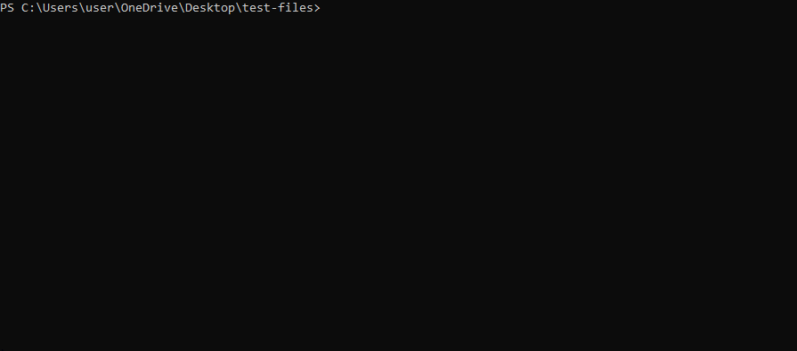

# WTouch

[](https://github.com/PolakiniO/WTouch/releases)
[](https://github.com/PolakiniO/WTouch/blob/main/LICENSE)
[](https://github.com/PolakiniO/WTouch)
[](https://github.com/PolakiniO/WTouch)

```text
 _       ________                 __
| |     / /_  __/___  __  _______/ /_
| | /| / / / / / __ \ / / / / ___/ __ \
| |/ |/ / / / / /_/ / /_/ / /__/ / / /
|__/|__/ /_/  \____/\__,_/\___/_/ /_/
```

**Native Windows touch. No WSL. No friction. Just works.**

A lightweight Windows-native implementation of the GNU `touch` command.  
Create files and update timestamps instantly from CMD or PowerShell.

Single binary. Drop in PATH. Done.

---

## Demo

Create and update files instantly - no WSL needed:



---

## Why WTouch?

Working on Windows often means switching to WSL for simple tasks like:

• Creating files  
• Updating timestamps  
• Running quick scripts  

WTouch removes that friction.

No environment switching. No overhead. Just one command.

---

## Quick Comparison

**Linux**
```
touch file.txt
```

**Windows (before)**
```
WSL → touch file.txt
```

**Windows (now)**
```
wtouch file.txt
```

---

## Features

- Create files when they do not exist (unless `--no-create`)
- Update access (`-a`) and modification (`-m`) times
- Copy timestamps from another file (`-r`)
- Apply explicit timestamps via `-d` and `-t`
- Expand Windows wildcards internally (`FindFirstFileW`)
- Full Unicode support
- Works with files and directories

---

## Installation

### Prebuilt binary (recommended)

Download from Releases and place in your PATH:

```bash
wtouch file.txt
```

---

### PowerShell install

```powershell
$destination = "$env:ProgramFiles\wtouch"
New-Item -ItemType Directory -Path $destination -Force | Out-Null
Invoke-WebRequest -Uri "https://github.com/PolakiniO/WTouch/releases/latest/download/wtouch.exe" -OutFile (Join-Path $destination 'wtouch.exe')
```

---

## Usage

```bash
wtouch [OPTION]... FILE...
```

### Examples

Create a file:

```bash
wtouch newfile.txt
```

Update modification time:

```bash
wtouch -m existing.txt
```

Update access time:

```bash
wtouch -a existing.txt
```

Copy timestamps:

```bash
wtouch -r source.txt target.txt
```

Set explicit timestamp:

```bash
wtouch -t 202511101138 file.txt
```

---

## Command Options

```
-a                   Change the access time only
-m                   Change the modification time only
-c, --no-create      Do not create any files
-d STRING            Parse explicit timestamp
-t STAMP             [[CC]YY]MMDDhhmm[.ss]
-r FILE              Use reference file timestamps
--                   Treat following args as literal paths
-h, --help           Show help
-V, --version        Show version
-P, --path           Show executable path
```

---

## Advanced

### Multiple implementations

- C++ (native, primary)
- C (portable)
- Python (cross-platform)
- Bash (wrapper)

---

## Build from Source

```powershell
cmake --preset windows-release
cmake --build --preset windows-release
cmake --install build/windows-release --config Release
```

---

## Uninstall

```powershell
.\scripts\uninstall-wtouch.ps1
```

Clean removal. No leftovers.

---

## Future Improvements

- Dry-run mode
- UTC timestamp support
- Symlink handling

---

## Disclaimer

Originally bootstrapped using OpenAI Codex.

---

## Contributing

Found a bug? Have an idea?

Open an issue or start a discussion. Contributions are welcome.
